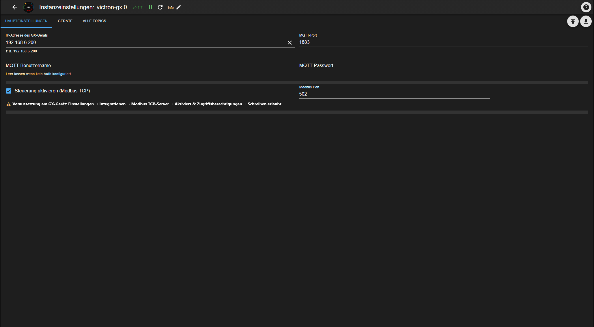
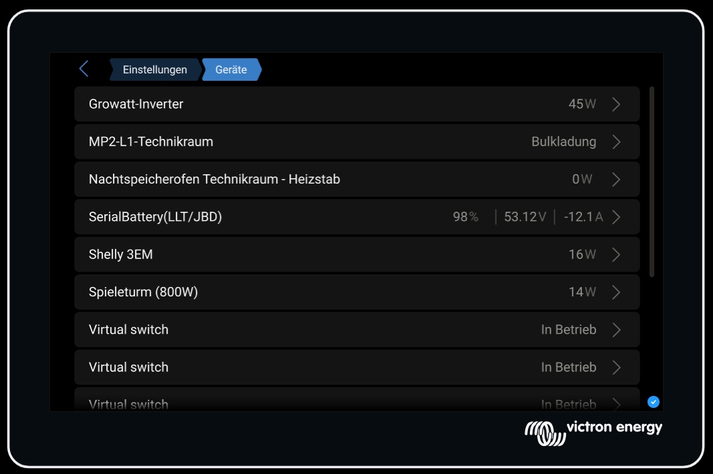
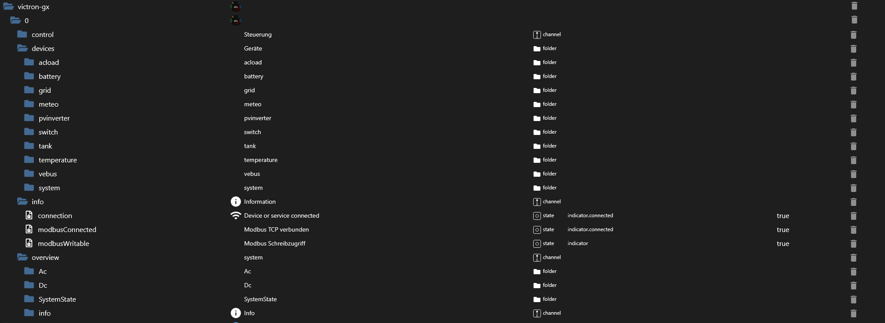
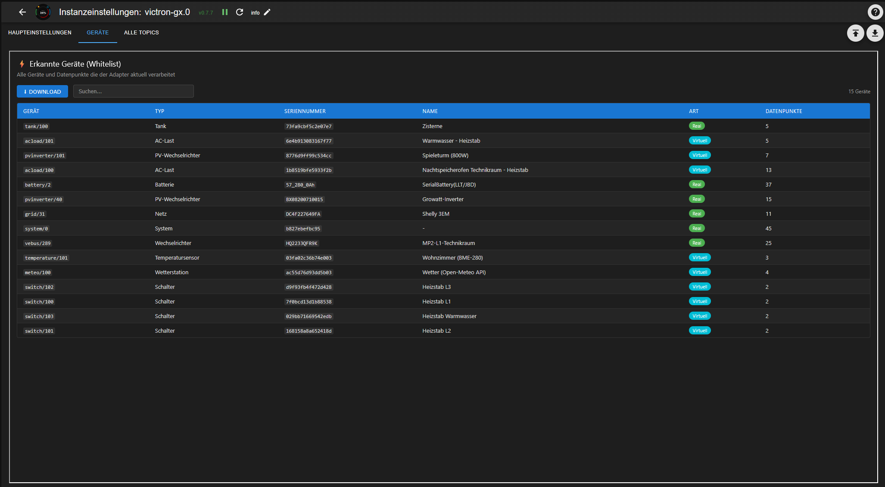
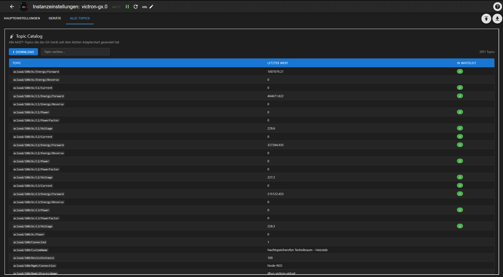

# ioBroker Victron GX Adapter


Connects ioBroker **directly and locally** to Victron GX devices (Cerbo GX, Venus GX, Ekrano GX) – without any detour through Home Assistant or the VRM Cloud.

[](https://www.npmjs.com/package/iobroker.victron-gx)
[](https://www.npmjs.com/package/iobroker.victron-gx)
[](https://www.npmjs.com/package/iobroker.victron-gx)
[](LICENSE)
[](https://nodejs.org)

[](https://ko-fi.com/sefinads)

🇩🇪 [Deutsche Anleitung](docs/README_de.md)

---

## What does this adapter do?

Connects ioBroker directly and locally to Victron GX devices via the local MQTT protocol. Supports reading all device data and full ESS/inverter control via Modbus TCP.

- All device datapoints are **discovered automatically** and created as ioBroker states
- Control exclusively through the `control.*` channel via Modbus TCP
- Works with single-phase and three-phase systems
- Automatic Modbus Unit ID discovery
- **Low RAM footprint**: ~130 MB stable
- Virtual devices via Node-RED (`dbus-victron-virtual`) are fully supported

---

## Requirements

**On the GX device:**
- Enable MQTT: `Settings → Integrations → MQTT access → On`
- For Modbus control: `Settings → Integrations → Modbus TCP Server → Enabled`
- Write access: `Access level → Write access allowed`

**In ioBroker:**
- Node.js >= 22
- Admin >= 7.7.28

---

## Installation

### Via ioBroker Admin (recommended)

Since this adapter is not yet in the official ioBroker repository, install it via the npm tab in the Admin interface:

1. Open ioBroker Admin
2. Go to **Adapters**
3. Click the **GitHub/Cat icon** (top right)
4. Select the **npm** tab
5. Enter `iobroker.victron-gx` and click **Install**

### Via command line

```bash
iobroker add victron-gx --allow-root
```

### After installation

1. Configure the instance:
   - Enter **IP address** of GX device
   - MQTT port: `1883` (default)
   - Optional: **Enable control** (activates Modbus TCP and `control.*` datapoints)

> **Note:** Node.js >= 22 is required. If your ioBroker is running on Node.js 20, please update first.

---

## Configuration



| Field | Description |
|-------|-------------|
| IP address of GX device | Local IP of Cerbo/Venus/Ekrano GX |
| MQTT port | Default: 1883 |
| MQTT username / password | Only if MQTT auth is configured on GX |
| Enable control | Activates Modbus TCP control |
| Modbus port | Default: 502 |

---

## Supported Devices

The adapter automatically discovers all devices connected to the GX device:



| Device type | Description |
|-------------|-------------|
| `battery` | Battery systems (e.g. SerialBattery/LLT/JBD) |
| `vebus` | MultiPlus/Quattro inverters |
| `grid` | Grid meters (e.g. Shelly 3EM, Carlo Gavazzi) |
| `pvinverter` | PV inverters |
| `acload` | AC loads |
| `switch` | Virtual switches (Node-RED) |
| `temperature` | Temperature sensors |
| `meteo` | Weather stations |
| `tank` | Tank level sensors |
| `system` | System overview |

---

## Object Structure



```
victron-gx.0
├── control.*          → Control via Modbus TCP
├── devices.*          → All discovered devices
│   ├── battery.*
│   ├── vebus.*
│   ├── grid.*
│   ├── pvinverter.*
│   ├── acload.*
│   ├── switch.*
│   ├── temperature.*
│   ├── meteo.*
│   ├── tank.*
│   └── system.*
├── overview.*         → System overview (from system/0)
└── info.*             → Connection status
```

---

## Device List (Admin)



The **Devices** tab shows all discovered devices with type, serial number, name and number of datapoints. The list can be downloaded as a JSON file – useful for support requests.

---

## Topic Catalog (Admin)



The **All Topics** tab shows all MQTT topics that the GX device has sent since the last adapter start. Topics processed by the adapter are marked with ✓. The catalog can be downloaded as a JSON file.

---

## Control

### Virtual Switches (Node-RED)
Set `State` to `true`/`false` → MQTT write → GX → Node-RED → relay

### ESS Grid Setpoint (simplest approach)
Write `control.system.GridSetpoint` [W]:
- `0` → zero feed-in (Victron ESS algorithm keeps grid at 0W)
- `-3000` → feed 3000W into grid (battery discharges)
- `+500` → draw 500W from grid (battery charges)

No keepalive needed – value is stored persistently.

### ESS Live Setpoint (direct control)
Write `control.inverter.AcPowerSetpoint` [W]:
- Requires `control.system.EssMode = 3` (External control)
- The adapter resends the value every 800ms while it is ≠ 0 (Victron watchdog)
- Set to `0` to return control to the Victron ESS algorithm

### Disable Charge / Feed-In
- `control.inverter.DisableCharge = 1` → battery will not charge
- `control.inverter.DisableFeedIn = 1` → inverter will not feed into grid

### DVCC Limits (requires DVCC enabled on GX)
- `control.system.DvccMaxChargeCurrent` [A]: system-wide charge current limit (-1 = disabled)
- `control.system.MaxDischargePower` [W]: discharge power limit

---

## Virtual Devices (Node-RED)

The adapter fully supports virtual devices created via Node-RED with the `dbus-victron-virtual` package:

- Virtual PV inverters
- Virtual AC loads
- Virtual switches (with group and individual name)
- Virtual temperature sensors
- Virtual weather stations
- Virtual tank sensors

---

## Changelog

### 0.8.8 (2026-06-14)
- Release 0.8.8

### 0.8.6 (2026-06-14)
- Fix: add Ac.Power to RELEVANT_PATHS for pvinverter, acload and grid devices

### 0.8.5 (2026-06-12)
- docs: add Ko-fi button and improved installation instructions

### 0.8.4 (2026-06-11)
- Coffe

### 0.8.3 (2026-06-11)
- NPN

### 0.8.2 (2026-06-11)
- Fix: memory leak caused by stale device timer using native clearTimeout instead of this.clearTimeout; fix: topic catalog now only stores new topics instead of re-allocating on every MQTT message

### 0.8.1 (2026-06-10)
- Fix: remove invalid nodeVersion from io-package.json; add localLinks; add i18n for admin config

### 0.8.0 (2026-06-10)
- Topic Map and Topic Catalog as Admin tabs; dynamic device discovery without timer; Switch CustomName from Node-RED; Node.js >= 22, Admin >= 7.7.28 required

### 0.7.7 (2026-06-09)
- Add localLink to instance overview for direct GX access

### 0.7.5 – 0.7.6
- Fix: remove invalid supportedMessages from io-package.json
- Add localLink to instance overview for direct GX access

### 0.7.3 – 0.7.4
- Performance: static fast-path after 60s discovery reduces RAM to ~100MB stable
- Add meteo device support
- Fix temperature device (Humidity/Pressure)
- Fix CustomName for all devices

### 0.7.0 – 0.7.2
- Performance: state object cache reduces RAM from ~660MB to ~155MB
- Full i18n support for all state names
- Fix object structure (folder/channel hierarchy)

### 0.6.0
- Breaking: `ess.*` renamed to `control.system.*`
- `control.inverter.*` added
- All device datapoints are strictly read-only
- AcPowerSetpoint keepalive every 800ms

### 0.1.0
- Complete read support for all device types

---

[Older changelogs](CHANGELOG_OLD.md)

## License

MIT License

Copyright (c) 2026 Sefina-DS
