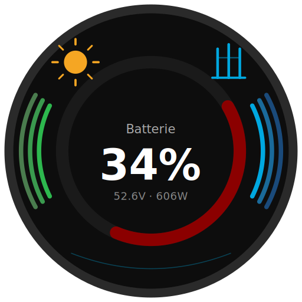

# ioBroker Victron GX Adapter



Connects ioBroker **directly and locally** to Victron GX devices (Cerbo GX, Venus GX, Ekrano GX) – without any detour through Home Assistant or the VRM Cloud.

[](https://www.npmjs.com/package/iobroker.victron-gx)
[](LICENSE)

---

## What does this adapter do?

Connects ioBroker directly and locally to Victron GX devices via the local MQTT protocol. Supports reading all device data and full ESS/inverter control via Modbus TCP.

- All device datapoints are **read-only** (except virtual switches via MQTT)
- Control happens exclusively through the `control.*` channel via Modbus TCP
- Works with single-phase and three-phase systems
- Automatic Modbus Unit ID discovery

## Requirements

**On the GX device:**
- Enable MQTT: `Settings → Integrations → MQTT access → On`
- For Modbus control: `Settings → Integrations → Modbus TCP Server → Enabled`
- Write access: `Write access allowed`

## Installation

1. Install adapter via ioBroker Admin
2. Configure instance:
   - Enter **IP address** of GX device
   - MQTT port: `1883` (default)
   - Optional: **Enable control** (activates Modbus TCP and `control.*` datapoints)

## Supported Devices

| Device | Read | Control |
|---|---|---|
| Battery / BMS (LiFePO4, AGM, ...) | ✅ | – |
| MultiPlus / Quattro (VE.Bus) | ✅ | ✅ Modbus |
| ESS / GX System Settings | ✅ | ✅ Modbus |
| Grid Meter | ✅ | – |
| AC Loads (real + Node-RED virtual) | ✅ | – |
| PV Inverters (real + Node-RED) | ✅ | – |
| Virtual Switches (Node-RED) | ✅ | ✅ MQTT |
| Solar Chargers (MPPT) | ✅ | – |
| System Overview | ✅ | – |

## Datapoint Structure

```
victron-gx.0
├── info.connection          ← MQTT connected (boolean)
├── info.modbusConnected     ← Modbus connected (boolean)
├── info.modbusWritable      ← Write access confirmed (boolean)
│
├── overview.*               ← Aggregated system values (read only)
│   ├── Dc.Battery.Soc / Voltage / Current / Power
│   ├── Ac.Grid.L1/L2/L3.Power/Current
│   ├── Ac.Grid.Power            ← calculated: L1+L2+L3
│   ├── Ac.Consumption.L1/L2/L3.Power
│   ├── Ac.Consumption.Power     ← calculated: L1+L2+L3
│   ├── Ac.PvOnGrid.L1/L2/L3.Power
│   ├── Ac.PvOnGrid.Power        ← calculated: L1+L2+L3
│   └── SystemState.State / TimeToGo
│
├── control.*                ← Writable control registers (only when control enabled)
│   ├── inverter.*           ← MultiPlus/Quattro (Modbus Unit 238)
│   │   ├── Mode             ← Reg 33: 1=Charger only, 2=Inverter only, 3=On, 4=Off (APS)
│   │   ├── AcIn1CurrentLimit← Reg 22: AC input current limit [A]
│   │   ├── AcPowerSetpoint  ← Reg 37: ESS live setpoint [W] (+=charge, -=feed-in)
│   │   │                       ⚠ Keepalive: value is re-sent every 800ms while ≠ 0
│   │   │                       ⚠ Requires ESS mode = External control (EssMode = 3)
│   │   ├── DisableCharge    ← Reg 38: 0=charging allowed, 1=charging blocked
│   │   └── DisableFeedIn    ← Reg 39: 0=feed-in allowed, 1=feed-in blocked
│   └── system.*             ← GX/ESS settings (Modbus Unit 100)
│       ├── GridSetpoint     ← Reg 2700: grid setpoint [W] (0=zero feed-in, -W=feed-in)
│       │                       Victron ESS algorithm controls Reg 37 automatically
│       ├── EssMode          ← Reg 2902: 1=with compensation, 2=without, 3=External
│       ├── BatteryLifeState ← Reg 2900: ESS operating mode
│       ├── MinimumSoc       ← Reg 2901: minimum SoC % (except grid failure)
│       ├── BatteryLifeSocLimit ← Reg 2903: BL SoC limit % (read only)
│       ├── MaxFeedInPower   ← Reg 2706: max feed-in [W] (-1=no limit, 0=blocked)
│       ├── AcFeedInEnabled  ← Reg 2708: 0=allowed, 1=blocked
│       ├── DcFeedInEnabled  ← Reg 2707: DC overvoltage feed-in (0=off, 1=on)
│       ├── FeedInLimitActive← Reg 2709: limiting active (read only)
│       ├── DvccMaxChargeCurrent ← Reg 2705: DVCC max charge current [A] (-1=disabled)
│       └── MaxDischargePower    ← Reg 2704: max discharge power [W] (DVCC only)
│
└── devices.*                ← Device data (read only, values exactly as received from GX)
    ├── battery.<Serial>
    │   ├── Soc, Dc.0.Voltage/Current/Power, TimeToGo, Capacity
    │   ├── cells.cell01–cell32 / min / max / diff
    │   ├── temperatures.main / temp1–temp4 / min / max
    │   └── alarms.lowVoltage / highVoltage / lowSoc
    ├── vebus.<Serial>
    │   ├── Mode, State, VebusError, VebusChargeState, Soc
    │   ├── Ac.ActiveIn.L1.P/I/V/S, Ac.ActiveIn.P
    │   ├── Ac.Out.L1.P/I/V/F/S, Ac.Out.P
    │   ├── Ac.In1.CurrentLimit
    │   ├── Hub4.L1.AcPowerSetpoint  ← live value (read only here, write via control.*)
    │   ├── Hub4.DisableFeedIn       ← live value (read only here)
    │   ├── Hub4.DisableCharge       ← live value (read only here)
    │   └── Dc.0.Voltage/Current/Power
    ├── grid.<Serial>
    │   └── Ac.L1/L2/L3.Power/Voltage/Current, Ac.Energy.Forward/Reverse
    ├── acload.<Serial>
    │   └── Ac.L1/L2/L3.Power/Voltage/Current, Ac.Energy.Forward
    ├── pvinverter.<Serial>
    │   ├── Ac.L1/L2/L3.Power/Voltage/Current
    │   └── StatusCode, ErrorCode, Ac.Frequency, Ac.MaxPower
    ├── solarcharger.<Serial>
    │   ├── Pv.V, Pv.P, Dc.0.Voltage/Current
    │   └── State, Yield.Power/Today/Total
    └── switch.<Group>.<Serial>
        ├── State  ← writable (true/false) via MQTT
        └── Status ← hardware feedback
```

## Control

### Virtual Switches (Node-RED)
Set `State` to `true`/`false` → MQTT Write → GX → Node-RED → Relay

### ESS Grid Setpoint (simplest approach)
Write `control.system.GridSetpoint` [W]:
- `0` → zero feed-in (Victron ESS algorithm keeps grid at 0W)
- `-3000` → feed 3000W into grid (battery discharges)
- `+500` → draw 500W from grid (battery charges)

The Victron ESS algorithm automatically calculates the correct inverter setpoint. No keepalive needed.

### ESS Live Setpoint (advanced / external control)
Write `control.inverter.AcPowerSetpoint` [W]:
- Requires `control.system.EssMode = 3` (External control)
- The adapter sends this value every 800ms as long as it is ≠ 0 (Victron watchdog)
- Set to `0` to return control to Victron ESS algorithm
- Use for dynamic control scripts (e.g. dynamic electricity tariffs)

### Disable Charge / Feed-In
- `control.inverter.DisableCharge = 1` → battery will not charge
- `control.inverter.DisableFeedIn = 1` → inverter will not feed into grid
  ⚠ Effect depends on system topology (AC-coupled vs. AC-out load)

### DVCC Limits (requires DVCC enabled on GX)
- `control.system.DvccMaxChargeCurrent` [A]: limit charge current system-wide (-1 = disabled)
- `control.system.MaxDischargePower` [W]: limit discharge power (DVCC only)

---

## Changelog

### 0.6.6 (2026-06-05)
- Fix: use this.setTimeout correctly in Promise wrappers

### 0.6.5 (2026-06-05)
- Update dependencies and fix setTimeout


### **WORK IN PROGRESS**
- (ioBroker-Bot) Adapter requires admin >= 7.8.23 now.

### 0.6.4 (2026-06-02)
- Fix: remove @types/mocha from devDependencies, remove 0.6.2 from news

### 0.6.3 (2026-06-02)
- Fix: add mocha types to tsconfig for TypeScript 6 compatibility

### 0.6.2 (2026-06-02)
- Update TypeScript to 6.0.3

### 0.6.1 (2026-06-02)
- Fix: cleaned up changelog, removed duplicate 0.6.0 entries

### 0.6.0 (2026-05-31)
- **Breaking change**: `ess.*` renamed to `control.system.*`, `control.inverter.*` added
- All device datapoints are now strictly read-only
- `control.*` channel added for all writable registers (Modbus only)
- `AcPowerSetpoint` keepalive: value re-sent every 800ms while ≠ 0
- Corrected scale factors for Reg 2704 (MaxDischargePower) and Reg 2706 (MaxFeedInPower)
- No default values written to registers on startup (read only, write on demand)
- `overview.Ac.Grid.Power`, `overview.Ac.Consumption.Power`, `overview.Ac.PvOnGrid.Power` added as calculated totals
- Automatic cleanup of legacy `ess.*` objects on startup
- `Hub4.DisableCharge` (Reg 38) added
- States/dropdown labels for vebus Mode, State, VebusChargeState, DisableFeedIn, DisableCharge

### 0.5.9 (2026-05-31)
- Fix: use this.setTimeout/setInterval, copyright in README

### 0.5.8 (2026-05-31)
- Fix: news entries reduced to 7

### 0.5.7 (2026-05-30)
- Fix: adapter-tests needs check-and-lint, automerge workflow renamed

### 0.5.6 (2026-05-29)
- Fix: switched to npm trusted publishing

### 0.5.5 (2026-05-29)
- Fix: npm-token added to deploy workflow

### 0.5.4 (2026-05-29)
- Fix: keywords in package.json, protectedNative/encryptedNative at root level

### 0.5.3 (2026-05-29)
- Fix: protectedNative/encryptedNative moved to root, tsconfig updated to node22, modbusHint size attributes

### 0.5.2 (2026-05-29)
- Fix: Node.js >= 22, admin >= 7.6.20, English-only README, jsonConfig cleanup, dependabot config

### 0.5.0 (2026-05-29)
- ESS control via Modbus Unit 100 (all settings)

### 0.1.0 (2026-05-27)
- Complete read support for all device types

---

[Older changelogs can be found there](CHANGELOG_OLD.md)

## License

MIT License

Copyright (c) 2026 Sefina-DS