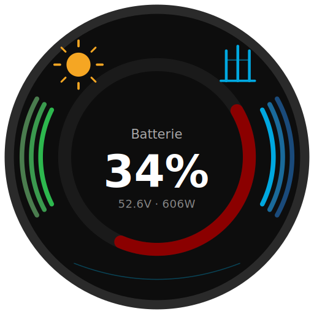

# ioBroker Victron GX Adapter



Dieser Adapter verbindet ioBroker **direkt und lokal** mit [Victron Energy](https://www.victronenergy.com/) GX-Geräten ([Cerbo GX, Venus GX, Ekrano GX](https://www.victronenergy.com/communication-centres)) – ohne Umweg über Home Assistant oder die VRM Cloud.

[](https://www.npmjs.com/package/iobroker.victron-gx)
[](https://www.npmjs.com/package/iobroker.victron-gx)
[](https://www.npmjs.com/package/iobroker.victron-gx)
[](../LICENSE)
[](https://nodejs.org)
[](https://ko-fi.com/sefinads)

---

## Was macht dieser Adapter?

Verbindet ioBroker direkt und lokal mit Victron GX Geräten über das lokale MQTT-Protokoll. Unterstützt das Lesen aller Gerätedaten und die vollständige ESS/Wechselrichter-Steuerung via Modbus TCP.

- Alle Geräte-Datenpunkte werden **automatisch erkannt** und als ioBroker States angelegt
- Steuerung ausschließlich über den `control.*` Kanal via Modbus TCP
- Funktioniert mit ein- und dreiphasigen Systemen
- Automatische Modbus Unit ID Erkennung
- **Geringer RAM-Verbrauch**: ~130 MB stabil
- Virtuelle Geräte via Node-RED (`dbus-victron-virtual`) werden vollständig unterstützt

---

## Voraussetzungen

**Am GX-Gerät:**
- MQTT aktivieren: `Einstellungen → Integrationen → MQTT-Zugang → Ein`
- Für Modbus-Steuerung: `Einstellungen → Integrationen → Modbus TCP-Server → Aktiviert`
- Zugriffsberechtigungen: `Zugangslevel → Schreiben erlaubt`

**In ioBroker:**
- Node.js >= 22
- Admin >= 7.7.28

---

## Installation

### Über den ioBroker Admin (empfohlen)

Da dieser Adapter noch nicht im offiziellen ioBroker Repository enthalten ist, wird er über den npm-Tab im Admin installiert:

1. ioBroker Admin öffnen
2. **Adapter** aufrufen
3. Oben rechts auf das **GitHub/Katzen-Symbol** klicken
4. Den **npm** Tab auswählen
5. `iobroker.victron-gx` eingeben und auf **Installieren** klicken

### Nach der Installation

1. Instanz konfigurieren:
   - **IP-Adresse** des GX-Geräts eintragen
   - MQTT-Port: `1883` (Standard)
   - Optional: **Steuerung aktivieren** (aktiviert Modbus TCP und `control.*` Datenpunkte)

> **Hinweis:** Node.js >= 22 ist erforderlich. Falls ioBroker noch mit Node.js 20 läuft, bitte zuerst ein Update durchführen.

---

## Konfiguration

| Feld | Beschreibung |
|------|--------------|
| IP-Adresse des GX-Geräts | Lokale IP des Cerbo/Venus/Ekrano GX |
| MQTT-Port | Standard: 1883 |
| MQTT-Benutzername / Passwort | Nur wenn MQTT-Auth am GX konfiguriert ist |
| Steuerung aktivieren | Aktiviert Modbus TCP Steuerung |
| Modbus-Port | Standard: 502 |

---

## Unterstützte Geräte

Der Adapter erkennt automatisch alle am GX-Gerät angeschlossenen Geräte:

| Gerätetyp | Beschreibung |
|-----------|--------------|
| `battery` | Batteriesysteme (z.B. SerialBattery/LLT/JBD) |
| `vebus` | MultiPlus/Quattro Wechselrichter |
| `grid` | Netzanschluss-Zähler (z.B. Shelly 3EM, Carlo Gavazzi) |
| `pvinverter` | PV-Wechselrichter |
| `acload` | AC-Verbraucher (inkl. Shelly 1PM, mit Schaltausgang) |
| `switch` | Schaltausgänge (Node-RED Virtual Switches, Shelly Pro3/Pro4/1PM, GX-internes Relais) |
| `temperature` | Temperatursensoren |
| `meteo` | Wetterstationen |
| `tank` | Tankfüllstandssensoren |
| `system` | Systemübersicht |

---

## Objektstruktur

```
victron-gx.0
├── control.*          → Steuerung via Modbus TCP
├── devices.*          → Alle erkannten Geräte
│   ├── battery.*
│   ├── vebus.*
│   ├── grid.*
│   ├── pvinverter.*
│   ├── acload.<Group>.<Serial>.
│   │   ├── Ac.*                     → Messwerte (unverändert)
│   │   └── outputs.<N>.             → Schaltausgang, falls vorhanden (z.B. Shelly 1PM)
│   │       ├── State                    bool, schreibbar
│   │       ├── Status                   bool, nur lesend
│   │       ├── Name / CustomName        string
│   │       └── Group                    string
│   ├── switch.<Group>.<Serial>.
│   │   └── outputs.<N>.             → ein Sub-Kanal pro Ausgang (Node-RED: einer, Shelly Pro3/4: bis zu vier)
│   │       ├── State / Status / Name / CustomName / Group   (wie oben)
│   ├── temperature.*
│   ├── meteo.*
│   ├── tank.*
│   └── system.*                     → trägt auch outputs.0.* für das GX-interne Relais
├── overview.*         → Systemübersicht (aus system/0), nur lesend
└── info.*             → Verbindungsstatus
```

`<Group>` ist ein optionaler Zwischenordner – nur vorhanden, wenn für den jeweiligen Kanal/das Gerät ein Gruppenname konfiguriert ist. Details siehe [Shelly-Integration & Multi-Kanal-Unterstützung](#shelly-integration--multi-kanal-unterstützung) weiter unten.

---

## Steuerung

### Virtuelle Schalter (Node-RED)
`State` auf `true`/`false` setzen → MQTT Write → GX → Node-RED → Relais

### ESS Grid Sollwert (einfachste Methode)
`control.system.GridSetpoint` [W] schreiben:
- `0` → Zero Feed-In (Victron ESS-Algorithmus hält Netz bei 0W)
- `-3000` → 3000W ins Netz einspeisen (Batterie entlädt)
- `+500` → 500W aus dem Netz beziehen (Batterie lädt)

Kein Keepalive nötig – Wert wird persistent gespeichert.

### ESS Live-Sollwert (direkte Steuerung)
`control.inverter.AcPowerSetpoint` [W] schreiben:
- Erfordert `control.system.EssMode = 3` (Externe Steuerung)
- Der Adapter sendet den Wert alle 800ms erneut solange er ≠ 0 ist (Victron Watchdog)
- Auf `0` setzen um die Steuerung an den Victron ESS-Algorithmus zurückzugeben

### Laden / Einspeisung deaktivieren
- `control.inverter.DisableCharge = 1` → Batterie lädt nicht
- `control.inverter.DisableFeedIn = 1` → Wechselrichter speist nicht ein

### DVCC Limits (erfordert aktiviertes DVCC am GX)
- `control.system.DvccMaxChargeCurrent` [A]: Systemweite Ladestrom-Begrenzung (-1 = deaktiviert)
- `control.system.MaxDischargePower` [W]: Entladeleistungs-Begrenzung

---

## Virtuelle Geräte (Node-RED)

Der Adapter unterstützt vollständig virtuelle Geräte die via Node-RED mit dem Paket `dbus-victron-virtual` erstellt wurden:

- Virtuelle PV-Wechselrichter
- Virtuelle AC-Verbraucher
- Virtuelle Schalter (mit Gruppe und individuellem Namen)
- Virtuelle Temperatursensoren
- Virtuelle Wetterstationen
- Virtuelle Tankfüllstandssensoren

---

## Shelly-Integration & Multi-Kanal-Unterstützung

Shelly-Geräte, die am GX (Cerbo/Venus/Ekrano) integriert sind, werden jetzt vollständig unterstützt, zusätzlich zu Node-RED Virtual Switches:

- **Shelly Pro3 / Pro4**: jedes physische Gerät meldet seine Kanäle als separate MQTT-DeviceInstances mit identischer Seriennummer. Der Adapter führt sie automatisch in einem einzigen Objektbaum zusammen (`devices.switch.<Group>.<Serial>.outputs.<0..3>.*`).
- **Shelly 1PM**: Messwerte (`Ac.*`) und der Schaltausgang (`outputs.0.*`) liegen am selben Geräte-Baum unter `devices.acload.<Group>.<Serial>`.
- **GX-internes Relais**: das im GX-Gerät eingebaute Relais (`system/0`) ist jetzt schaltbar unter `devices.system.<Serial>.outputs.0.State`, ohne zusätzliche Konfiguration.

Alle Schaltausgänge – unabhängig vom Gerätetyp – teilen sich dieselbe Unterstruktur, wodurch Wildcard-Selektoren über die gesamte Installation hinweg funktionieren:

```javascript
// Alle Schaltausgänge, egal welcher Gerätetyp, egal welche Gruppe
'victron-gx.0.devices.*.*.*.outputs.*.State'

// Nur die Custom-Namen, für eine Geräteübersicht
'victron-gx.0.devices.*.*.*.outputs.*.CustomName'
```

### ⚠️ Breaking Change (v0.9.x)

Schaltausgänge lagen bisher direkt unter dem Geräte-Kanal; sie liegen jetzt unter einem `outputs.<N>`-Sub-Kanal. Node-REDs `output_1` wird auf `outputs.1` normiert:

| Alt (v0.8.x) | Neu (v0.9.x) |
|---|---|
| `devices.switch.<Group>.<Serial>.State` | `devices.switch.<Group>.<Serial>.outputs.1.State` |
| `devices.switch.<Group>.<Serial>.Status` | `devices.switch.<Group>.<Serial>.outputs.1.Status` |

Skripte, Vis-Widgets oder Blockly-Regeln, die die alten Pfade direkt referenzieren, müssen angepasst werden.

Wer die übrig gebliebenen alten Objekte loswerden will, führt Folgendes in der ioBroker-CLI aus (die Schleife umgeht den bekannten "Invalid ID: undefined"-Fehler beim Löschen über die Admin-UI):

```bash
iobroker object list | grep -oP 'victron-gx\.0\.devices\.switch\.[^.]+\.[^.]+\.(State|Status)$' \
  | while read id; do iobroker object del "$id"; done
```

### Automatisches Aufräumen verwaister Kanäle (optional)

Wenn ein Kanal in eine andere Gruppe verschoben, ein Shelly-Kanal deaktiviert oder ein Node-RED-Switch gelöscht wird, verschwindet zwar dessen MQTT-Topic – die ioBroker-Objekte bleiben aber bestehen. Mit **Verwaiste Kanäle beim Start entfernen** (Tab „Haupteinstellungen", standardmäßig aus) räumt der Adapter diese automatisch auf:

- Läuft einmal pro Adapter-Start, erst nachdem ca. 30 Sekunden lang kein neu erkannter Kanal mehr dazukam (damit Multi-Kanal-Geräte wie der Shelly Pro3, dessen Instances zeitlich leicht versetzt reinkommen, beim Start nicht betroffen sind).
- Betrifft ausschließlich `outputs.<N>`-Kanäle. Geräte-Metadaten, `Ac.*`-Messwerte und `overview.*` werden davon nie entfernt.
- Bei häufig offline befindlichen Geräten sollte die Option deaktiviert bleiben – ein Kanal, der sich bis zum Sweep-Zeitpunkt noch nicht zurückgemeldet hat, sieht verwaist aus und würde gelöscht.

---

## Changelog

Den vollständigen Changelog gibt es in der englischen README:
→ [README.md Changelog](../README.md#changelog)

---

## Lizenz

MIT License

Copyright (c) 2026 Sefina-DS
